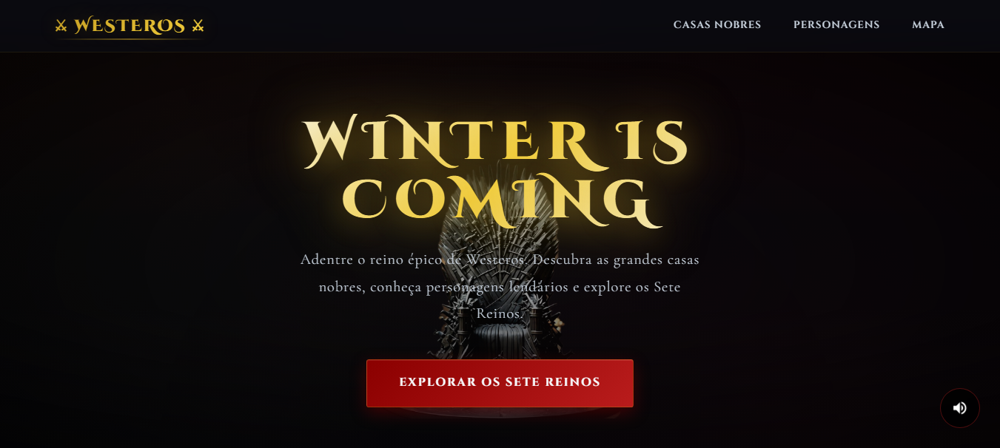
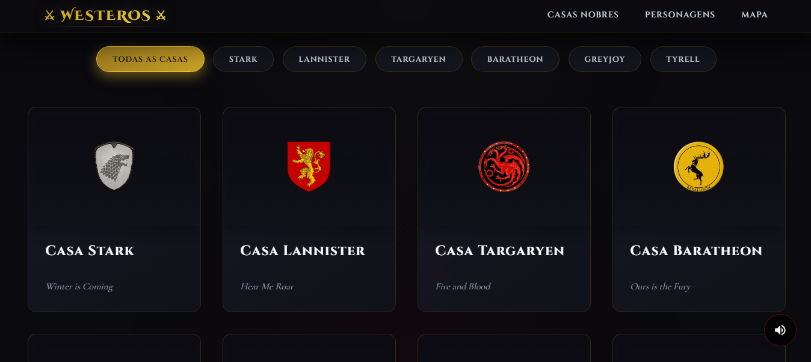
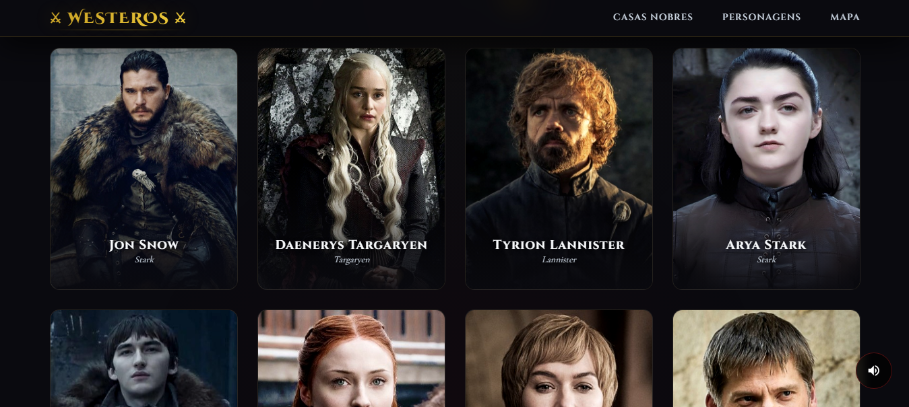
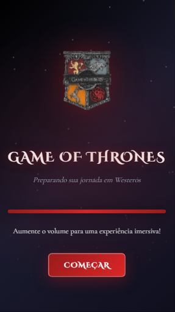
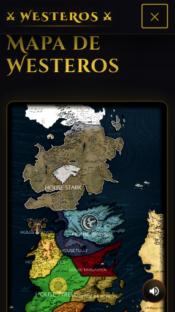

<h1>🐺 Projeto Game of Thrones — Casas de Westeros 2.0</h1>  

<p>Este é um projeto front-end desenvolvido para praticar HTML, CSS e JavaScript, explorando conceitos de estruturação de páginas, manipulação de dados, responsividade(grid/flex) e criação de interfaces temáticas.</p>  

<p>A aplicação apresenta informações sobre as principais casas do universo de Game of Thrones, exibindo seus lemas, regiões e características de forma dinâmica.</p>  

<h2>📸 Preview</h2>  
<br>








<h2>🚀 Deploy</h2>  

🔗 Acesse o projeto online:
https://malcomtribe-ai.github.io/GOT-project/

<h2>🎯 Objetivo do Projeto</h2>  

<h3>Este projeto foi criado com foco em:</h3>

<p>Praticar estrutura semântica <b>HTML</b></p>  

<p>Trabalhar com estilização avançada em <b>CSS</b></p>  

<p>Manipular dados usando <b>JavaScript</b></p>  

<p>Criar componentes dinâmicos (cards das casas e dos personagens)</p> 
<p>Tornar responsivo para <b>desktop/mobile</b></p>

<p>Organizar código como um projeto real</p>

<p>Evoluir no desenvolvimento front-end</p>  

<h2>🏰 Casas Apresentadas</h2>  

<p>Stark — Winter is Coming</p>  

<p>Lannister — Hear Me Roar</p>  

<p>Targaryen — Fire and Blood</p>  

<p>Baratheon — Ours is the Fury</p>  

<p>Greyjoy — We Do Not Sow</p>  

<p>Tyrell — Growing Strong</p>  

<p>Arryn — As High as Honor</p>

<p>Tully — Family, Duty, Honor</p>

<h2>🛠️ Tecnologias Utilizadas</h2>  

<b>HTML5</b>

<b>CSS3</b>

<b>JavaScript (Vanilla JS)</b>

<b>Git & GitHub</b>

<h2>📚 Aprendizados</h2>  

<p>Durante o desenvolvimento, foram aplicados conceitos importantes como:</p>  
<p>Organização de layout</p>  

<p>Responsividade básica</p>  

<p>Manipulação de arrays e objetos no JavaScript</p>

<p>Separação de responsabilidades (HTML / CSS / JS)</p>  

<p>versionamento com GIT</p>

<p>Estruturação de projeto para portfólio</p>

<h2>💡 EVOLUÇÃO DO PROJETO</h2>
## 🎬 MELHORIAS IMPLEMENTADAS

### ✨ DESIGN VISUAL PREMIUM

#### 🎨 Paleta de Cores Profissional
- **Dourado épico** (#c9a227) como cor de destaque principal
- **Gradientes cinematográficos** em todos os elementos
- **Vermelho sangue** para botões e CTAs
- **Azul gelo** para elementos Stark
- **Fundos escuros** multicamadas para profundidade

#### 🖋 Tipografia de Alto Nível
- **Cinzel Decorative** - Títulos principais (estilo medieval/épico)
- **Cinzel** - Subtítulos e navegação (elegante e forte)
- **Cormorant Garamond** - Corpo de texto (legível e sofisticado)
- Tracking e kerning ajustados profissionalmente

### 🎭 ANIMAÇÕES E EFEITOS

#### Scroll Reveal System
- Elementos aparecem gradualmente ao rolar a página
- Efeito cascata nos cards (delay progressivo)
- Intersection Observer para performance

#### Parallax no Hero
- Logo e conteúdo com movimento parallax suave
- Fade out progressivo ao rolar
- Atmosfera com brilho animado

#### Hover Effects Premium
- **Cards das Casas:**
  - Elevação 3D ao passar o mouse
  - Brilho dourado animado
  - Escala da imagem com filtro drop-shadow
  - Gradiente overlay suave

- **Cards de Personagens:**
  - Zoom na imagem com desfoque reduzido
  - Nome com glow dourado
  - Transições ultra suaves

#### Header Inteligente
- Backdrop blur com transparência
- Muda ao rolar (menor e com mais sombra)
- Links com animação de sublinhado
- Menu mobile responsivo

### 🎯 MODAL PREMIUM

- **Design Luxuoso:**
  - Backdrop blur de 15px
  - Bordas com gradiente animado
  - Tema específico para cada casa
  - Botão de fechar com rotação 90° no hover

- **Animações:**
  - Scale + fade in suave
  - Imagem com float animation
  - Fecha com ESC ou clique fora

### 🎪 SISTEMA DE FILTROS

- Botões estilizados com backdrop blur
- Ativação com gradiente dourado
- Animação de lift no hover
- Filtragem com delay progressivo

### 📱 RESPONSIVIDADE TOTAL

- **Desktop (>1024px):**
  - Cursor customizado com efeito de trailing
  - Layouts espaçosos
  - Parallax e efeitos completos

- **Tablet (768-1024px):**
  - Grid adaptativo
  - Menu hambúrguer estilizado

- **Mobile (<768px):**
  - Menu dropdown com blur
  - Cards otimizados
  - Touch-friendly

### ⚡ PERFORMANCE

- **Lazy Loading:**
  - Imagens carregadas sob demanda
  - Intersection Observer nativo

- **Otimizações:**
  - CSS com variáveis reutilizáveis
  - Transitions com GPU acceleration
  - Scroll suave nativo

---


<h3>📂 Estrutura do Projeto</h3>

<p>📁 GOT-project</p> 
<p>├── assets/</p>
<p>│   ├── image/</p>
<p>│   │   ├── logo-got.png</p>
<p>│   │   ├── logo-stark.PNG</p>
<p>│   │   ├── logo-lannister.PNG</p>
<p>│   │   ├── logo-targaryen.PNG</p>
<p>│   │   ├── logo-baratheon.PNG</p>
<p>│   │   ├── logo-greyjoy.PNG</p>
<p>│   │   ├── logo-tyrell.PNG</p>
<p>│   │   ├── map-westoros.png</p>
<p>│   │   └── [todas as imagens dos personagens]</p>
<p>│   └── audio/</p>
<p>│       └── got-theme.mp3</p>
<p>│</p>
<p>├── css/</p>
<p>│   └── style.css</p>        
<p>│
<p>├── js/
<p>│   ├── audio.js</p>       
<p>│   ├── loading.js</p>     
<p>│   └── script.js</p>
<p>│</p>
<p>└── index.html</p> 
<br>
## 🚀 PASSO A PASSO DE INSTALAÇÃO

### 1️⃣ SUBSTITUIR ARQUIVOS PRINCIPAIS

**CSS:**
- Abra o arquivo `css/style.css`
- DELETE todo o conteúdo atual
- COLE todo o conteúdo do arquivo **`style-cinematic.css`** que forneci

**JavaScript:**
- Abra o arquivo `js/script.js`
- DELETE todo o conteúdo atual
- COLE todo o conteúdo do arquivo **`script-cinematic.js`** que forneci

**HTML:**
- Abra o arquivo `index.html`
- DELETE todo o conteúdo atual
- COLE todo o conteúdo do arquivo **`index-cinematic.html`** que forneci

### 2️⃣ MANTER ARQUIVOS DO LOADING

**Esses arquivos JÁ FORAM CRIADOS anteriormente, MANTENHA-OS:**
- `js/audio.js`
- `js/loading.js`

### 3️⃣ ADICIONAR ESTILOS DO LOADING NO CSS

Abra `css/style.css` (que agora tem o conteúdo cinematográfico) e **ADICIONE NO FINAL** o conteúdo do arquivo **`loading-styles.css`** que foi fornecido anteriormente.

---

## 🎨 RECURSOS ADICIONAIS

### Fontes Utilizadas (Google Fonts)
As fontes são carregadas automaticamente via CDN:
- Cinzel Decorative
- Cinzel
- Cormorant Garamond

### Cores Principais (CSS Variables)
```css
--gold: #c9a227;           /* Dourado principal */
--gold-light: #f4d03f;     /* Dourado claro */
--blood-red: #8b0000;      /* Vermelho sangue */
--ice-blue: #a5c9ff;       /* Azul gelo */
--dark-primary: #0a0a0f;   /* Fundo escuro */
```

---

## 🎯 FUNCIONALIDADES

### ✅ Sistema de Loading
- Barra de progresso animada
- Mensagens dinâmicas
- Botão só aparece ao completar
- Inicia música ao clicar

### ✅ Navegação
- Scroll suave entre seções
- Header que se adapta ao scroll
- Menu mobile responsivo
- Links com animação

### ✅ Casas
- 7 grandes casas nobres
- Sistema de filtros
- Modais temáticos
- Descrições expandidas

### ✅ Personagens
- 28 personagens principais
- Grid responsivo
- Modal com biografia completa
- Imagens em alta qualidade

### ✅ Controle de Música
- Botão flutuante
- Play/Pause
- Volume ajustado (30%)
- Loop infinito

---

## 🔧 CUSTOMIZAÇÃO

### Alterar Cores
Edite as variáveis em `style.css` (início do arquivo):
```css
:root {
    --gold: #c9a227;  /* Mude aqui */
}
```

### Adicionar Novas Casas
No arquivo `script.js`, adicione no array `houses`:
```javascript
{
    name: "Casa Nova",
    motto: "Lema da Casa",
    region: "Região",
    image: "./assets/image/logo-nova.PNG",
    theme: "nova",
    description: "Descrição da casa..."
}
```

Depois adicione o CSS do tema no `style.css`:
```css
.modal-content.nova {
    background: linear-gradient(145deg, [cor1], [cor2]);
    border-color: [cor];
}
```

---

## 🎬 EFEITOS ESPECIAIS

### Cursor Customizado (Desktop)
Cursor dourado que segue o mouse com delay suave. Aumenta ao passar em elementos clicáveis.

### Partículas Flutuantes
Efeito de neve/cinzas caindo na tela de loading.

### Glow Effects
Brilho suave em títulos, botões e elementos hover.

---

## 📊 COMPARAÇÃO: ANTES vs DEPOIS

| Recurso | Antes | Depois |
|---------|-------|--------|
| Tela de Loading | ❌ | ✅ Épica com animações |
| Áudio de Fundo | ❌ | ✅ Com controle |
| Scroll Reveals | ❌ | ✅ Todos os cards |
| Parallax | ❌ | ✅ Hero section |
| Cursor Custom | ❌ | ✅ Desktop only |
| Tipografia Premium | ❌ | ✅ 3 fontes profissionais |
| Gradientes | Básicos | ✅ Avançados em tudo |
| Hover Effects | Simples | ✅ Premium 3D |
| Modais Temáticos | ❌ | ✅ Cor por casa |
| Header Dinâmico | ❌ | ✅ Muda ao rolar |
| Filtros Animados | Básicos | ✅ Premium com delay |
| Performance | OK | ✅ Lazy loading + Observers |

---

## 🏆 RESULTADO FINAL

Um website digno de **HBO**, com:
- Design cinematográfico profissional
- Animações suaves e sofisticadas
- Experiência imersiva total
- Performance otimizada
- 100% responsivo

**NÍVEL ALCANÇADO:** 🔥🔥🔥🔥🔥 ÉPICO!

---

## 💡 DICAS DE USO

1. **Teste em diferentes navegadores:** Chrome, Firefox, Safari
2. **Ajuste o volume da música** se necessário no arquivo `audio.js` (linha 5)
3. **Personalize as cores** das casas conforme preferir
4. **Adicione mais personagens** facilmente no array

---

## 🐛 TROUBLESHOOTING

**Música não toca:**
- Verifique se o arquivo `got-theme.mp3` está em `assets/audio/`
- Certifique-se de clicar no botão "ENTRAR EM WESTEROS"

**Animações não funcionam:**
- Limpe o cache do navegador
- Verifique se todos os 3 arquivos JS estão carregando

**Imagens não aparecem:**
- Confirme os caminhos das imagens
- Verifique se todas estão na pasta `assets/image/`
 <br>
<h3>▶️ Como Executar o Projeto Localmente</h3>

<p>Siga os passos abaixo para rodar o projeto na sua máquina:</p> 

<p>1. Clone o repositório:</p> 
<p>git clone https://github.com/malcomtribe-ai/GOT-project.git</p>


<p>2. Acesse a pasta do projeto:</p>
<p>cd GOT-project</p>

<p>3. Abra o arquivo `index.html` no navegador.</p> 

<p>Pronto! O projeto já estará funcionando localmente.</p> 


<h2>👨‍💻 Autor</h2>  

Desenvolvido por Malcom Matheus, programador front-end.

<p> Conecte-se comigo:</p> 
<p>🔗<a href="https://www.linkedin.com/in/malcom-matheus/">LinkedIn</a></p>  
<p>📧 E-MAIL:malcom.tribe@gmail.com</p>
<br>

